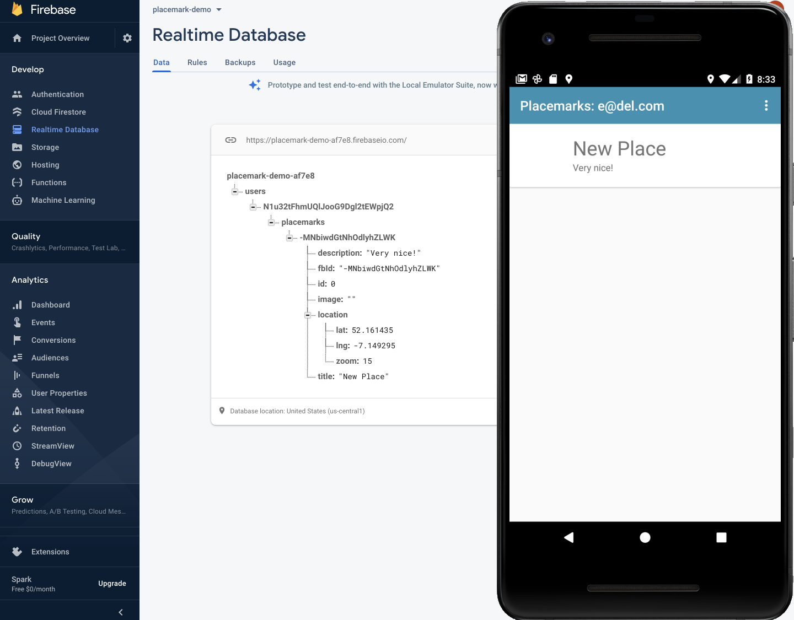
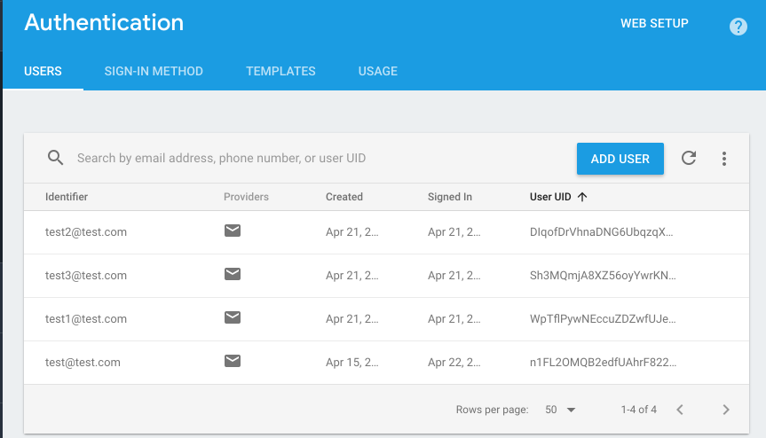
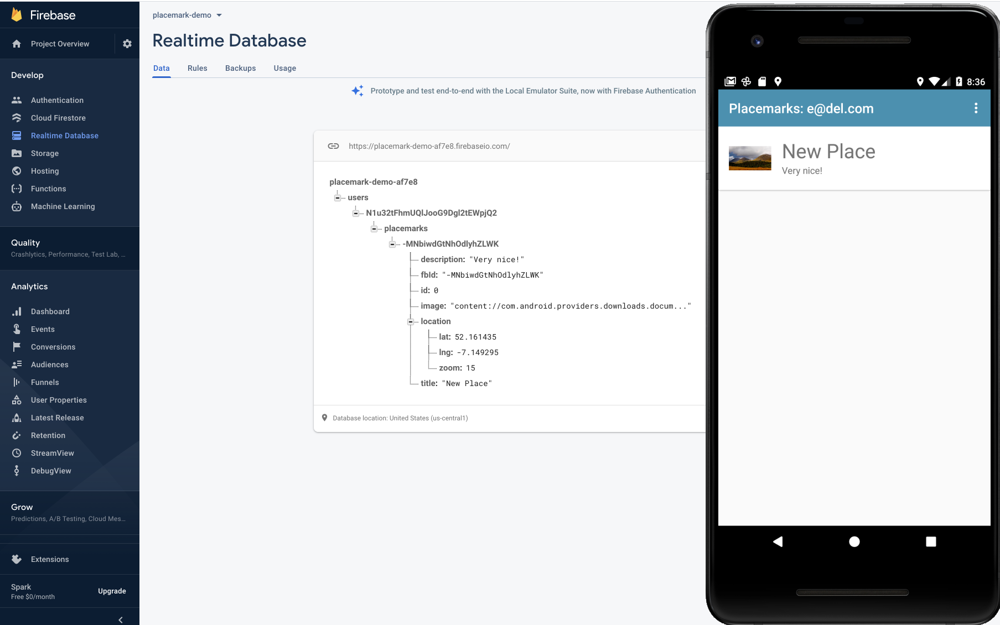

## Console

Create the PlacemarkFireStore now in MainApp:

~~~
class MainApp : Application(), AnkoLogger {

  lateinit var placemarks: PlacemarkStore

  override fun onCreate() {
    super.onCreate()
    //placemarks = PlacemarkJSONStore(applicationContext)
    //placemarks = PlacemarkStoreRoom(applicationContext)
    placemarks = PlacemarkFireStore(applicationContext)
    info("Placemark started")
  }
}
~~~

Run the app now, log in and create some placemarks (you may need to do a complete rebuild).

Keep an eye on the Database console:

You should see the placemarks you create populating here. Each users placemarks are grouped under the user id. And individual placemarks are under their own unique id.

User Ids can be cross-referenced on the Authentication panel:

Experiment with various accounts + placemarks now. Verify that when you log in you get the placemarks relevant to the logged in user.

Also - note that the images are still stored locally. Add an image to a placemark and examine the image path. 

So, although they will display as normal - they will not be available if you change emulators/phones. 

Perhaps try this now to verify that placemark images are localised to a specific phone.

