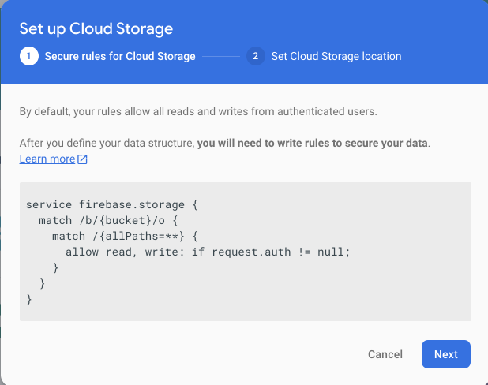

# Firebase Storage

In the Firebase Console, select `Storage`:

Press `Get Started`:

Then press `Next`

Select the storage location and press `Done`

This gives a general purpose file storage area:

We will use this to store the placemark images.

In Studio, `Tools->Firebase` 

Press 'Upload and download a file with Cloud Storage`

The press `Add Cloud Storage to your app`

`Accept changes` to update your gradle and googe-services.json

