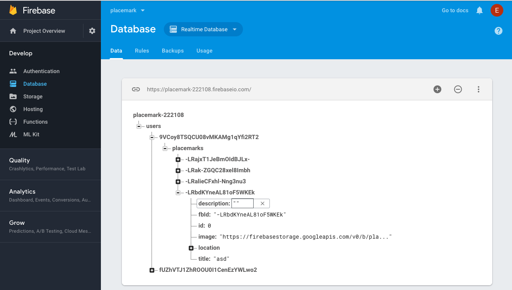

# PlacemarkFireStore

We need a new reference to the Storage object:

~~~kotlin
  lateinit var st: StorageReference
~~~

We can augment PlacemarkFireStore with a new method:

~~~kotlin
  fun updateImage(placemark: PlacemarkModel) {
    if (placemark.image != "") {
      val fileName = File(placemark.image)
      val imageName = fileName.getName()

      var imageRef = st.child(userId + '/' + imageName)
      val baos = ByteArrayOutputStream()
      val bitmap = readImageFromPath(context, placemark.image)

      bitmap?.let {
        bitmap.compress(Bitmap.CompressFormat.JPEG, 100, baos)
        val data = baos.toByteArray()
        val uploadTask = imageRef.putBytes(data)
        uploadTask.addOnFailureListener {
          println(it.message)
        }.addOnSuccessListener { taskSnapshot ->
          taskSnapshot.metadata!!.reference!!.downloadUrl.addOnSuccessListener {
            placemark.image = it.toString()
            db.child("users").child(userId).child("placemarks").child(placemark.fbId).setValue(placemark)
          }
        }
      }
    }
  }
~~~

This will be called whenever the user selects an image.

This first part will load into a bitmap object the image the user as selected from the gallery:

~~~kotlin
      val fileName = File(placemark.image)
      val imageName = fileName.getName()

      var imageRef = st.child(userId + '/' + imageName)
      val baos = ByteArrayOutputStream()
      val bitmap = readImageFromPath(context, placemark.image)
~~~

Then, if the bitmap successfully loaded, we compress it to save on bandwidth and obtain a reference to the bits:

~~~kotlin
        bitmap.compress(Bitmap.CompressFormat.JPEG, 100, baos)
        val data = baos.toByteArray()
~~~

Then we upload to the firebase storage service:

~~~kotlin
        uploadTask.addOnFailureListener {
        }.addOnSuccessListener {
        }
~~~

If the upload goes successfully:

~~~kotlin
         { taskSnapshot ->
          taskSnapshot.metadata!!.reference!!.downloadUrl.addOnSuccessListener {
            placemark.image = it.toString()
            db.child("users").child(userId).child("placemarks").child(placemark.fbId).setValue(placemark)
          }
~~~

we need to obtain a public url where the image is stored, and then place this string into the database entry for the placemark.

This is the complete PlacemarkFireStore at at this stage - including all the code above:

## PlacemarkFireStore

~~~kotlin
package org.wit.placemark.models.firebase

import android.content.Context
import android.graphics.Bitmap
import com.google.firebase.auth.FirebaseAuth
import com.google.firebase.database.*
import com.google.firebase.storage.FirebaseStorage
import com.google.firebase.storage.StorageReference
import org.jetbrains.anko.AnkoLogger
import org.wit.placemark.helpers.readImageFromPath
import org.wit.placemark.models.PlacemarkModel
import org.wit.placemark.models.PlacemarkStore
import java.io.ByteArrayOutputStream
import java.io.File

class PlacemarkFireStore(val context: Context) : PlacemarkStore, AnkoLogger {

  val placemarks = ArrayList<PlacemarkModel>()
  lateinit var userId: String
  lateinit var db: DatabaseReference
  lateinit var st: StorageReference

  override fun findAll(): List<PlacemarkModel> {
    return placemarks
  }

  override fun findById(id: Long): PlacemarkModel? {
    val foundPlacemark: PlacemarkModel? = placemarks.find { p -> p.id == id }
    return foundPlacemark
  }

  override fun create(placemark: PlacemarkModel) {
    val key = db.child("users").child(userId).child("placemarks").push().key
    key?.let {
      placemark.fbId = key
      placemarks.add(placemark)
      db.child("users").child(userId).child("placemarks").child(key).setValue(placemark)
      updateImage(placemark)
    }
  }

  override fun update(placemark: PlacemarkModel) {
    var foundPlacemark: PlacemarkModel? = placemarks.find { p -> p.fbId == placemark.fbId }
    if (foundPlacemark != null) {
      foundPlacemark.title = placemark.title
      foundPlacemark.description = placemark.description
      foundPlacemark.image = placemark.image
      foundPlacemark.location = placemark.location
    }

    db.child("users").child(userId).child("placemarks").child(placemark.fbId).setValue(placemark)
    if ((placemark.image.length) > 0 && (placemark.image[0] != 'h')) {
      updateImage(placemark)
    }
  }

  override fun delete(placemark: PlacemarkModel) {
    db.child("users").child(userId).child("placemarks").child(placemark.fbId).removeValue()
    placemarks.remove(placemark)
  }

  override fun clear() {
    placemarks.clear()
  }

  fun updateImage(placemark: PlacemarkModel) {
    if (placemark.image != "") {
      val fileName = File(placemark.image)
      val imageName = fileName.getName()

      var imageRef = st.child(userId + '/' + imageName)
      val baos = ByteArrayOutputStream()
      val bitmap = readImageFromPath(context, placemark.image)

      bitmap?.let {
        bitmap.compress(Bitmap.CompressFormat.JPEG, 100, baos)
        val data = baos.toByteArray()
        val uploadTask = imageRef.putBytes(data)
        uploadTask.addOnFailureListener {
          println(it.message)
        }.addOnSuccessListener { taskSnapshot ->
          taskSnapshot.metadata!!.reference!!.downloadUrl.addOnSuccessListener {
            placemark.image = it.toString()
            db.child("users").child(userId).child("placemarks").child(placemark.fbId).setValue(placemark)
          }
        }
      }
    }
  }

  fun fetchPlacemarks(placemarksReady: () -> Unit) {
    val valueEventListener = object : ValueEventListener {
      override fun onCancelled(dataSnapshot: DatabaseError) {
      }
      override fun onDataChange(dataSnapshot: DataSnapshot) {
        dataSnapshot!!.children.mapNotNullTo(placemarks) { it.getValue<PlacemarkModel>(PlacemarkModel::class.java) }
        placemarksReady()
      }
    }
    userId = FirebaseAuth.getInstance().currentUser!!.uid
    db = FirebaseDatabase.getInstance().reference
    st = FirebaseStorage.getInstance().reference
    placemarks.clear()
    db.child("users").child(userId).child("placemarks").addListenerForSingleValueEvent(valueEventListener)
  }
}
~~~

If you try this out now. If you have a placemark already created, change the image and then look at the Firebase Database console:

You should see a firebase storage url in the image field.

This is a public url - so you should be able to copy this url and paste it into a browser and retrieve the image.
